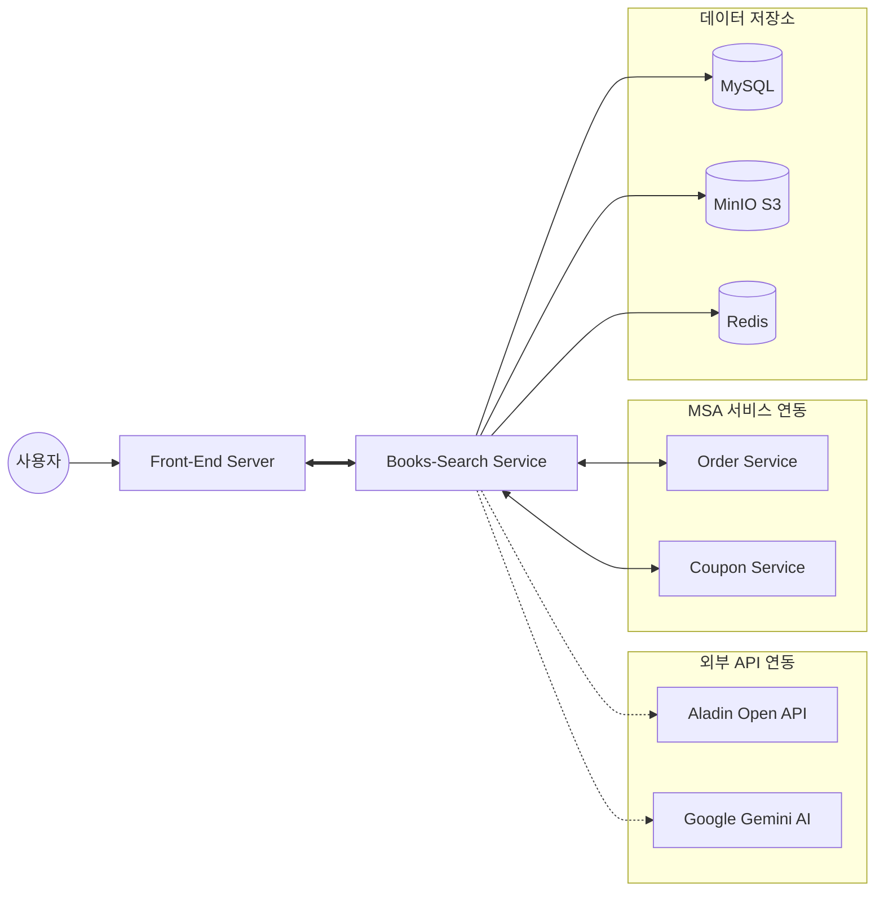
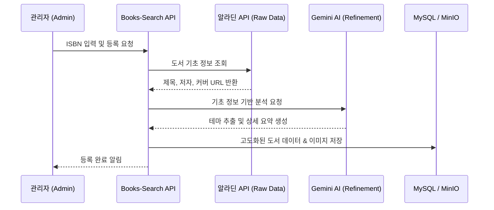

# 📖 Books-Search API Module

도서 쇼핑몰의 핵심인 **도서 메타데이터 관리, 고도화된 카테고리 체계, 리뷰 및 사용자 인터랙션(좋아요)**을 담당하는 핵심 API 모듈입니다.
## Key Features
1. 도서 및 콘텐츠 관리
   - 자동화된 데이터 수집: ISBN 입력 시 알라딘 Open API를 통해 도서 기본 정보(제목, 저자, 출판사 등)를 실시간으로 수집하고 Google Gemini AI에게 전달하여 데이터 가공 및 내용 추가로 도서에 대한 내용을 풍부하게 합니다. 
   - TUI Editor 기반 도서 관리: 마크다운 형식을 지원하여 도서 상세 정보 및 목록을 풍부하게 표현합니다.
   - MinIO 오브젝트 스토리지: 모든 도서 및 리뷰 이미지는 MinIO에 저장되며, 마이그레이션 툴을 통해 대량 관리를 지원합니다.
   - 소프트 삭제(Soft Delete): isDeleted 필드를 활용하여 데이터를 보존하되, 일반 사용자에게는 404를 응답하고 관리자 페이지에서만 추적 가능하도록 구현했습니다.

2. 고도화된 카테고리 체계
   - 트리 구조(Tree Structure) 응답: 카테고리 네비게이션을 위해 계층 구조로 데이터를 가공하여 프론트엔드에 전달합니다. (프론트 Redis 캐싱 연동)
   - 카테고리 경로 정보: 도서 등록/조회 시 최하위 카테고리를 기준으로 전체 상위 경로 정보를 포함하여 사용자 편의성을 높였습니다.

3. 사용자 인터랙션 및 리뷰
   - 주문 연동형 리뷰: 유저ID와 주문상세ID를 확인 후 리뷰 등록이 가능합니다.
   - 개인화된 도서 목록: 로그인 유저가 도서 목록 조회 시, 각 도서에 대한 '좋아요' 여부를 실시간으로 반영하여 응답합니다.

4. 마이크로서비스 연동 (Internal API)
   - 주문(Order) API: 주문 시 도서 존재 여부, 재고 검증 데이터를 실시간으로 제공합니다.
   - 쿠폰(Coupon) API: 쿠폰 적용 범위(카테고리 등) 확인을 위한 데이터를 공유합니다.

## System Architecture
### 1. 시스템 아키텍처 (전체 구조)

### 2. 도서 자동 등록 프로세스 (데이터 흐름)

## Tech Stack
- Framework: Spring Boot 3.5.7, Spring Data JPA
- Storage: MySQL, Redis, MinIO (Object Storage)
- Docs: Swagger (OpenAPI 3.0)
- DevOps: Docker, GitHub Actions (CI/CD)

## API Specification
| Tag         | Summary             | Method       | Endpoint                   |
|-------------|---------------------|-------------|----------------------------|
| Book V2     | 도서 상세 정보 조회         | GET          | /api/v2/books/{bookId}     |
| Book V2     | 단일 도서 등록 (Multipart) | POST         | /api/v2/books              |
| Category V2 | 카테고리 트리 구조 조회       | GET          | /api/v2/categories/tree    |
| Review V2   | 리뷰 등록 및 이미지 업로드     | POST         | /api/v2/reviews            |
| Like V2     | 도서 좋아요 등록/취소        | POST/DELETE  | /api/v2/likes/{bookId}     |
| Admin       | 관리자용 도서 통계 조회       | GET          | /api/v2/admin/books/total  |

## Security & Environment
보안이 필요한 키 정보는 GitHub Secrets를 통해 관리되며, 배포 시 Docker 컨테이너의 환경 변수로 주입됩니다.

- BOOKS_GEMINI_API_KEY: AI 분석용 키
- MINIO_ACCESS_KEY / MINIO_SECRET_KEY: 이미지 스토리지 자격 증명
- 
## 성능 및 설계 최적화 (Optimization & Architecture)

### 1. 데이터 조회 및 다중 연관 관계 최적화
* **다중 일대다(One-to-Many) 관계 처리**: 도서 도메인의 특성상 태그, 이미지, 카테고리 등 다수의 일대다 관계가 존재합니다. `Fetch Join`의 한계(단일 컬렉션 페치 조인 제한)를 극복하기 위해 다음과 같은 전략을 사용했습니다.
    - **@BatchSize 활용**: 연관된 엔티티 조회 시 `n+1` 문제를 방지하기 위해 `@BatchSize(size = 100)`를 적용, 필요한 시점에 적절한 크기의 `IN` 쿼리로 대량 로딩하도록 최적화했습니다.
    - **Projection Interface & Native Query**: 엔티티 전체를 영속성 컨텍스트에 올릴 필요가 없는 대량 조회 성능 향상을 위해 프로젝션 인터페이스와 최적화된 네이티브 쿼리를 조합하여 필요한 필드만 선별적으로 조회했습니다.

### 2. 순환 참조 해결 및 계층 분리
* **Facade Pattern 도입**: 도서 등록, AI 분석, 이미지 업로드 등 여러 서비스가 복합적으로 작용하는 로직에서 발생하는 **순환 참조(Circular Dependency)** 문제를 해결했습니다.
* **비즈니스 로직 응집도 향상**: 복합적인 워크플로우를 Facade 레이어에서 오케스트레이션하여 각 모듈 간의 결합도를 낮추고 유지보수성을 확보했습니다.

## Code Quality (SonarQube)
