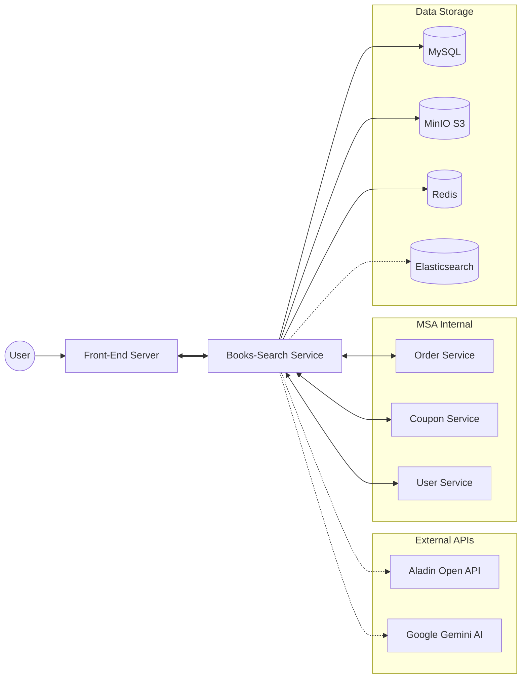
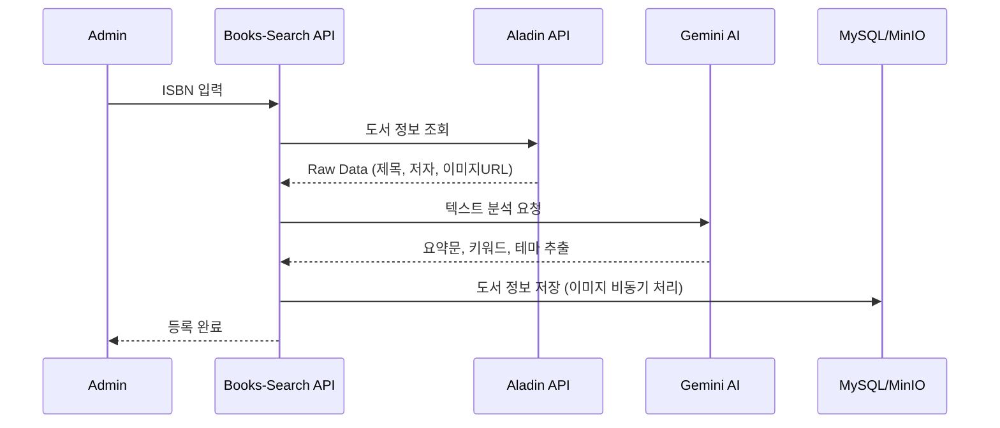

# 📖 Books-Search API Module

도서 쇼핑몰의 핵심인 **도서 메타데이터 관리, 고도화된 카테고리 체계, 리뷰 및 사용자 인터랙션(좋아요)**을 담당하는 핵심 API 모듈입니다.
단순한 CRUD를 넘어, **대량 데이터 처리 최적화, 외부 시스템과의 정합성 보장, 비동기 처리를 통한 성능 향상** 등 다양한 기술적 과제를 해결하는 데 중점을 두었습니다.

## 🚀 Key Features & Technical Challenges

### 1. 도서 및 콘텐츠 관리 (Content Management)
*   **하이브리드 도서 등록**: 관리자 수동 입력 및 ISBN 기반 자동 완성(알라딘 API + Google Gemini AI 요약) 지원.
*   **TUI Editor & MinIO**: 마크다운 에디터 지원 및 이미지 자산의 오브젝트 스토리지(MinIO) 중앙화.
*   **[Challenge] 대량 이미지 마이그레이션**: 외부 URL 이미지를 내부 스토리지로 옮길 때, 단일 트랜잭션 실패가 전체 작업에 영향을 주지 않도록 **격리 수준(Propagation.REQUIRES_NEW)**을 조절하여 안정성을 확보했습니다.
    *   👉 [상세 기술 문서: ImageProcessor (Transaction Isolation)](docs/ImageProcessor.md)

### 2. 검색 엔진 동기화 (Search Engine Synchronization)
*   **데이터 정합성 보장**: 도서 정보 변경 시 검색 엔진(Elasticsearch) 데이터를 갱신해야 합니다.
*   **[Challenge] 트랜잭션과 이벤트 발행의 불일치**: DB 커밋 전 이벤트가 발행되면, DB 롤백 시 검색 엔진과 데이터가 달라지는 문제가 발생합니다. 이를 해결하기 위해 **TransactionSynchronizationManager**를 활용하여 **After Commit** 시점에만 이벤트를 발행하도록 구현했습니다.
    *   👉 [상세 기술 문서: BookSearchSyncPublisher (Transaction Sync)](docs/BookSearchSyncPublisher.md)

### 3. 고도화된 카테고리 및 할인 정책 (Category & Discount)
*   **트리 구조 카테고리**: 계층형 카테고리 구조를 프론트엔드에 최적화된 트리 형태로 변환하여 제공 (Redis 캐싱 적용).
*   **복합 할인 정책**: 전역, 카테고리별, 출판사별, 도서별 등 다양한 할인 정책을 중첩 적용.
*   **[Challenge] 복잡한 할인 계산과 N+1 문제**: 정률/정액 할인의 우선순위를 정립하고, 도서 목록 조회 시 관련된 모든 할인 정책을 **Bulk 조회 후 메모리 매핑**하여 성능을 최적화했습니다.
    *   👉 [상세 기술 문서: DiscountPolicyService (Optimization)](docs/DiscountPolicyService.md)

### 4. 사용자 인터랙션 및 외부 연동 (Interaction & Integration)
*   **리뷰 및 좋아요**: 주문 내역 검증 후 리뷰 작성, 실시간 좋아요 반영.
*   **[Challenge] 외부 서비스 통신 지연**: 리뷰 작성 시 포인트 적립(User Service) 호출이 느려지면 사용자 경험을 해칩니다. 이를 **비동기(@Async) 처리**하고, 실패 시 **재시도(@Retryable)**하도록 설계하여 시스템 결합도를 낮췄습니다.
    *   👉 [상세 기술 문서: PointService (Async & Retry)](docs/PointService.md)

### 5. 대량 데이터 일괄 처리 (Bulk Operation)
*   **[Challenge] 연관 관계 데이터의 비효율적 저장**: 엑셀 업로드 등 대량 도서 등록 시, 출판사나 태그 정보를 건건이 조회하면 DB 부하가 심합니다. 이를 **일괄 조회(IN Query) 및 메모리 매핑** 방식으로 개선하여 쿼리 수를 획기적으로 줄였습니다.
    *   👉 [상세 기술 문서: PublisherV2Service (Bulk Insert)](docs/PublisherV2Service.md)
    *   👉 [상세 기술 문서: TagV2Service (Bulk Insert)](docs/TagV2Service.md)

### 6. 성능 및 설계 최적화 (Optimization & Architecture)
*   **[Challenge] 다중 연관 관계 조회 성능**: 도서 엔티티는 태그, 이미지 등 다수의 일대다 관계를 가집니다. `Fetch Join`의 한계(MultipleBagFetchException)를 극복하기 위해 **`@BatchSize`**를 적용하여 N+1 문제를 해결하고, 단순 조회용 데이터는 **Projection Interface**를 사용하여 성능을 최적화했습니다.
*   **[Challenge] 순환 참조 및 결합도**: 여러 서비스가 얽힌 복잡한 로직에서 순환 참조 문제가 발생했습니다. 이를 해결하기 위해 **Facade Pattern**을 도입하여 비즈니스 로직의 응집도를 높이고 계층을 명확히 분리했습니다.
    *   👉 [상세 기술 문서: Query Optimization & Architecture](docs/QueryOptimization.md)

---

## 🏗 System Architecture

### 1. 전체 시스템 구조

### 2. 도서 등록 및 AI 분석 프로세스

---

## 🛠 Tech Stack
| Category | Technology |
|----------|------------|
| **Framework** | Spring Boot 3.5.7, Spring Data JPA |
| **Language** | Java 21 |
| **Database** | MySQL 8.0, Redis |
| **Storage** | MinIO (Object Storage) |
| **Search** | Elasticsearch (via Message Queue) |
| **Docs** | Swagger (OpenAPI 3.0) |
| **Build/Deploy** | Docker, GitHub Actions |

## 📝 API Specification
| Tag | Summary | Method | Endpoint |
|-----|---------|--------|----------|
| **Book** | 도서 상세 조회 | `GET` | `/api/v2/books/{bookId}` |
| **Book** | 도서 등록 (Multipart) | `POST` | `/api/v2/books` |
| **Category** | 카테고리 트리 조회 | `GET` | `/api/v2/categories/tree` |
| **Review** | 리뷰 등록 | `POST` | `/api/v2/reviews` |
| **Like** | 좋아요 토글 | `POST` | `/api/v2/likes/{bookId}` |

## 🔒 Security & Environment
주요 민감 정보는 GitHub Secrets 및 Docker 환경 변수로 관리됩니다.
- `BOOKS_GEMINI_API_KEY`: AI 도서 분석용 API Key
- `MINIO_ACCESS_KEY` / `MINIO_SECRET_KEY`: 오브젝트 스토리지 인증 정보

## 📊 Code Quality

