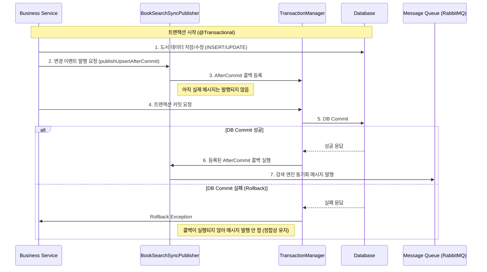

# BookSearchSyncPublisher

`BookSearchSyncPublisher`는 도서 정보의 변경 사항(등록, 수정, 삭제)이 발생했을 때, **DB 트랜잭션과 검색 엔진(Elasticsearch) 간의 데이터 정합성**을 보장하기 위한 컴포넌트입니다.

## 핵심 문제 및 해결 (Problem & Solution)

*   **문제 상황 (Problem)**: 비즈니스 로직 수행 중 검색 엔진에 인덱싱 요청을 보냈으나, 이후 DB 트랜잭션이 롤백된다면? -> **DB에는 데이터가 없는데 검색 엔진에는 데이터가 남는 불일치 발생.**
*   **해결 방안 (Solution)**: Spring의 `TransactionSynchronizationManager`를 활용하여 **"DB 트랜잭션이 성공적으로 커밋된 직후(After Commit)"**에만 메시지를 발행하도록 시점을 제어합니다.

## Process Visualization (Mermaid)



## 주요 기능

1.  **트랜잭션 후처리 (After Commit)**
    *   트랜잭션이 활성화되어 있지 않은 경우에는 즉시 실행하여 유연성을 확보합니다.
    *   트랜잭션 롤백 시 불필요한 인덱싱 요청을 원천 차단합니다.

2.  **도서 등록/수정 동기화 (`publishUpsertAfterCommit`)**
    *   `Book` 엔티티를 검색 엔진 스키마에 맞는 `RabbitBook` DTO로 변환하여 발행합니다.

3.  **도서 삭제 동기화 (`publishDeleteAfterCommit`)**
    *   삭제된 도서의 ISBN을 키로 하여 삭제 이벤트를 발행합니다.

## 사용 예시

```java
@Service
@RequiredArgsConstructor
public class BookFacade {
    private final BookSearchSyncPublisher bookSearchSyncPublisher;

    @Transactional
    public void registerBook(BookReqV2DTO bookReqDTO) {
        // 1. DB 저장
        Book book = bookRepository.save(bookReqDTO.toEntity());
        
        // 2. 동기화 요청 (실제 발행은 커밋 후)
        bookSearchSyncPublisher.publishUpsertAfterCommit(book, "BOOK_REGISTER");
    }
}
```
