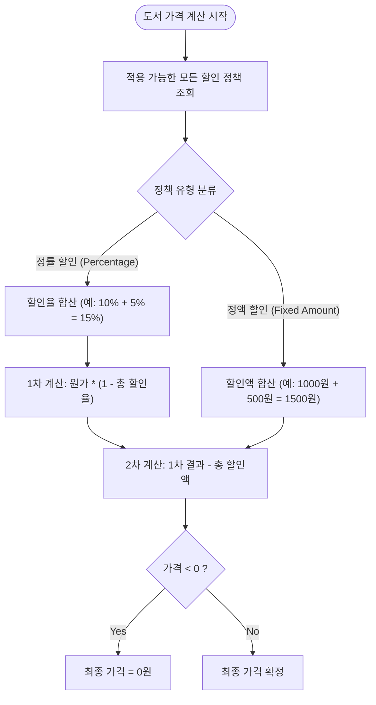

# DiscountPolicyService

`DiscountPolicyService`는 도서에 적용되는 다양한 할인 정책(전역, 카테고리, 출판사, 개별 도서)을 조회하고, 우선순위에 따라 최종 가격을 계산하는 도메인 서비스입니다.

## 핵심 문제 및 해결 (Problem & Solution)

*   **문제 상황 (Problem)**: 하나의 도서에 "전역 10% 할인", "카테고리 1000원 할인", "신간 5% 할인" 등 여러 정책이 중첩될 때, 어떤 순서로 계산해야 하는지 모호하며, 목록 조회 시 N+1 쿼리 문제가 발생할 수 있음.
*   **해결 방안 (Solution)**:
    1.  **계산 로직 표준화**: 정률(%) 할인 합산 적용 후 -> 정액(-) 할인 적용으로 순서를 고정하여 일관성 확보.
    2.  **Bulk 조회 최적화**: 도서 목록 조회 시 관련된 모든 할인 정책을 한 번의 쿼리로 가져와 메모리에서 매핑(`Map`)하여 성능 저하 방지.

## Logic Visualization (Mermaid)

### 할인 가격 계산 흐름도



## 주요 기능

1.  **다양한 타겟팅 지원 (TargetType)**
    *   `GLOBAL`: 전체 도서
    *   `CATEGORY`: 특정 카테고리 하위 도서
    *   `PUBLISHER`: 특정 출판사 도서
    *   `PRODUCT`: 특정 도서 지정

2.  **대량 데이터 처리 최적화 (`getDiscountPriceMap`)**
    *   `List<BookId>`를 입력받아 `Map<BookId, DiscountResponse>`를 반환합니다.
    *   반복문 내에서 DB 조회를 하지 않고, 미리 조회된 데이터를 활용합니다.

## 사용 예시

```java
// 도서 목록 조회 시 (N+1 방지)
public List<BookListRespDTO> getBookList(List<Long> bookIds) {
    // 1. 할인 정책 일괄 조회 및 계산
    Map<Long, DiscountDTO.Response> discountMap = discountPolicyService.getDiscountPriceMap(requestMap);
    
    // 2. 도서 정보와 매핑
    return bookList.stream()
        .map(book -> new BookListRespDTO(book, discountMap.get(book.getId())))
        .toList();
}
```
