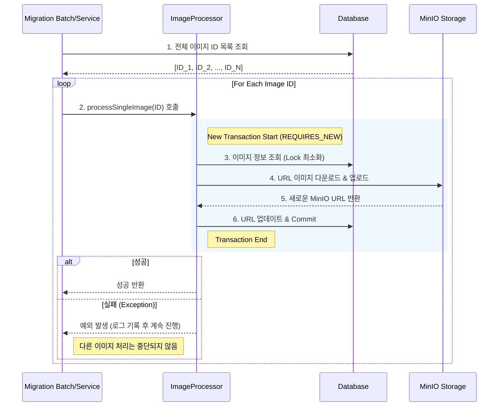

# ImageProcessor

`ImageProcessor`는 외부 URL로 저장된 도서 이미지를 내부 스토리지(MinIO)로 마이그레이션하는 작업을 처리합니다. 대량의 작업을 안정적으로 수행하기 위해 **트랜잭션 격리 전략**을 사용합니다.

## 핵심 문제 및 해결 (Problem & Solution)

*   **문제 상황 (Problem)**: 수천 장의 이미지를 마이그레이션하는 도중, 단 한 장의 이미지 업로드 실패로 인해 전체 작업이 롤백되거나, 트랜잭션이 너무 길어져 DB 커넥션을 점유하는 문제 발생.
*   **해결 방안 (Solution)**: `Propagation.REQUIRES_NEW`를 사용하여 각 이미지 처리 작업을 **독립적인 트랜잭션**으로 분리합니다. 이를 통해 개별 실패가 전체 프로세스에 영향을 주지 않도록 격리합니다.

## Process Visualization (Mermaid)



## 주요 기능

1.  **독립적인 트랜잭션 처리 (`REQUIRES_NEW`)**
    *   상위 트랜잭션의 존재 여부와 관계없이 항상 새로운 트랜잭션을 시작합니다.
    *   작업 단위가 작아져 DB 락 점유 시간을 최소화합니다.

2.  **이미지 마이그레이션 (URL -> MinIO)**
    *   외부 의존성을 제거하고 내부 스토리지로 자산을 중앙화합니다.
    *   중복 처리를 방지하기 위해 현재 URL이 이미 MinIO 도메인인지 검사하는 로직이 포함되어 있습니다.

## 사용 예시

```java
@Service
public class ImageMigrationService {
    // ...
    public void migrateAllImages() {
        List<Long> allImageIds = bookImageRepository.findAllIds();
        
        for (Long imageId : allImageIds) {
            try {
                // 개별 트랜잭션으로 실행되므로, 하나가 실패해도 루프는 계속됨
                imageProcessor.processSingleImage(imageId);
            } catch (Exception e) {
                log.error("이미지 처리 실패: {}", imageId, e);
            }
        }
    }
}
```
