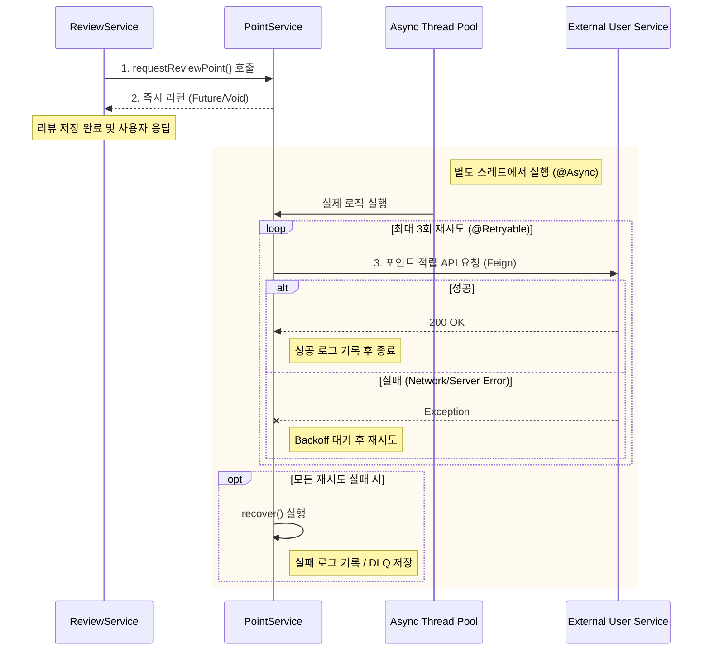

# PointService

`PointService`는 리뷰 작성 등 사용자 활동에 대한 보상(포인트)을 지급하기 위해 외부 User 서비스와 통신하는 역할을 합니다. **시스템 안정성과 사용자 경험(응답 속도)**을 최우선으로 설계되었습니다.

## 핵심 문제 및 해결 (Problem & Solution)

*   **문제 상황 (Problem)**: 외부 User API 서버가 일시적으로 느려지거나 장애가 발생하면, 리뷰 작성 기능 전체가 실패하거나 응답이 지연되어 사용자 경험을 해침.
*   **해결 방안 (Solution)**:
    1.  **비동기 처리 (`@Async`)**: 포인트 적립 요청을 별도 스레드로 분리하여, 메인 로직(리뷰 저장)은 즉시 성공 응답을 반환.
    2.  **재시도 패턴 (`@Retryable`)**: 일시적 네트워크 오류 발생 시 자동으로 재시도하여 데이터 유실 최소화.

## Process Visualization (Mermaid)



## 주요 기능

1.  **비동기 처리 (`@Async("CustomTaskExecutor")`)**
    *   핵심 비즈니스 로직과 부가 기능(포인트)의 결합도를 낮춥니다.
    *   사용자 대기 시간을 획기적으로 단축합니다.

2.  **재시도 메커니즘 (`@Retryable`)**
    *   `FeignException` 발생 시에만 동작하도록 설정.
    *   **Exponential Backoff**: 3초 -> 6초 -> 12초 간격으로 재시도하여 복구 시간을 벌어줍니다.

3.  **장애 복구 (`@Recover`)**
    *   최종 실패 시 별도의 복구 로직(로그, 알림, 재처리 큐 적재 등)을 수행할 수 있는 진입점을 제공합니다.

## 사용 예시

```java
@Transactional
public void registerReview(ReviewReqDTO dto) {
    // 1. 리뷰 저장 (핵심 로직)
    reviewRepository.save(review);
    
    // 2. 포인트 적립 요청 (비동기 - 실패해도 리뷰 저장은 롤백되지 않음)
    pointService.requestReviewPoint(userId, PointPolicyType.REVIEW_TEXT);
}
```
